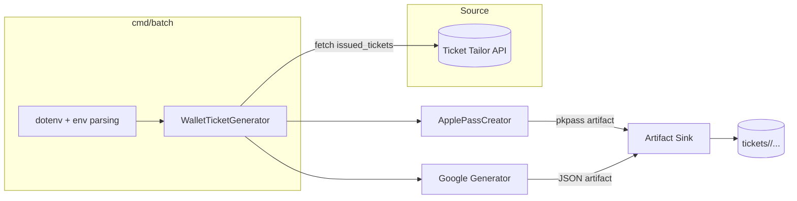
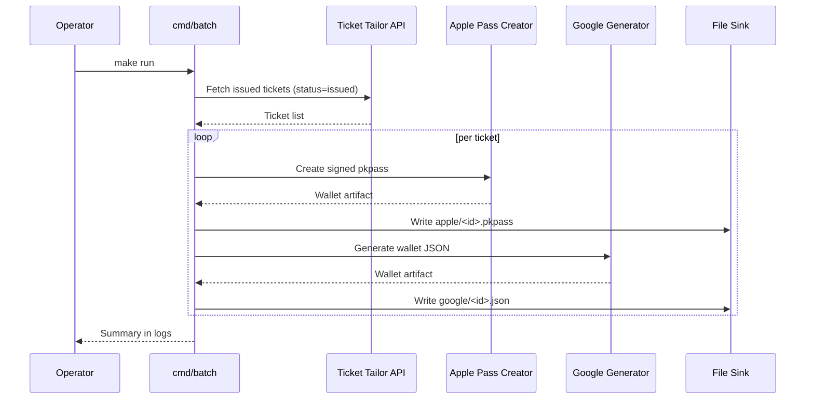

# Hakuna Wallet

Hakuna Wallet synchronizes issued tickets from Ticket Tailor and turns them into Apple Wallet (`.pkpass`) and Google Wallet (`.json`) passes. The batch CLI fetches new tickets, renders platform-specific artifacts, and writes them to the local filesystem so they can be distributed downstream.

- Generates Apple Wallet passes with signed payloads using `passkit`.
- Creates Google Wallet objects with deterministic JSON payloads for ingestion.
- Streams structured logs via `zap` for easier observability.
- Ships with Postgres scaffolding and migrations for persistence-oriented workflows.

## System Overview





## Repository Layout

- `src/cmd/batch`: Entry point that loads configuration, wires dependencies, and runs the ticket generator.
- `src/pkg/batch`: Orchestrates ticket fetching, platform generators, and artifact sinks.
- `src/pkg/tickets`: Ticket Tailor client, models, and check-in helpers.
- `src/pkg/wallet/apple`: Apple Wallet pass creation and signing logic.
- `src/pkg/wallet/google`: Google Wallet JSON artifact generator.
- `src/pkg/http_logs`: HTTP client wrapper that logs outbound requests.
- `src/pkg/logger`: Zap logger initialization.
- `src/pkg/db/migrations`: SQL migrations for persisting ticket metadata.
- `certs/`: Apple certificate bundle expected by the Apple pass creator.
- `tickets/`: Default output directory for generated artifacts (organized by platform).

## Prerequisites

- Go 1.24.x (see `src/go.mod`).
- Ticket Tailor API credentials with permission to list issued tickets.
- Apple Wallet certificates (`.p12`, WWDR CA) and password.
- Google Wallet issuer email and service account credentials.
- Docker (optional) for the bundled Postgres service in `docker-compose.yml`.

## Configuration

The CLI loads environment variables via `godotenv`. Create a `.env` file in the repository root before running the batch job.

```bash
cp .env.example .env    # create your own template if needed
```

| Variable | Required | Description |
| --- | --- | --- |
| `TICKETTAILOR_API_KEY` | ✅ | Ticket Tailor API token (Basic auth, sent in Authorization header). |
| `TT_EVENT_ID` | ✅ | Ticket Tailor event identifier used to scope issued tickets. |
| `TT_BASE_URL` | ✅ | Base URL for the Ticket Tailor API (e.g. `https://api.tickettailor.com/v1`). |
| `DATABASE_URL` | ✅ | Postgres connection string; used by future persistence layers and migrations. |
| `APPLE_P12_PATH` | Conditional | Path to the Apple Wallet signing certificate (`.p12`). Provide either this or `APPLE_P12_BASE64`. |
| `APPLE_P12_PASSWORD` | ✅ | Password for the certificate above. |
| `APPLE_P12_BASE64` | Conditional | Base64-encoded Apple signing certificate. When set, the app writes the decoded file to `/tmp/certs/apple-signing.p12`. |
| `APPLE_ROOT_CERT_PATH` | Conditional | Path to the Apple WWDR CA certificate (`.cer`). Provide either this or `APPLE_ROOT_CERT_BASE64`. |
| `APPLE_ROOT_CERT_BASE64` | Conditional | Base64-encoded Apple root certificate. When set, the app writes the decoded file to `/tmp/certs/apple-root.cer`. |
| `APPLE_PASS_TYPE_IDENTIFIER` | ✅ | Pass type identifier registered with Apple. |
| `APPLE_TEAM_IDENTIFIER` | ✅ | Apple Developer team ID associated with the pass. |
| `GOOGLE_SERVICE_ACCOUNT_JSON` | ✅ | Inline JSON for the Google Wallet service account credentials. |
| `GOOGLE_ISSUER_EMAIL` | ✅ | Google Wallet issuer email. |
| `BATCH_CRON` | optional | Cron expression for scheduling runs if embedded in a future service (`@every 5m` default). |
| `DATA_DIR` | optional | Working directory for scratch data (`/app/data` default). |
| `PORT` | optional | Reserved for API deployments (defaults to `8080`). |
| `TICKETS_DIR` | optional | Output directory for generated artifacts (`tickets`). |

> For local development, keep certificate paths relative to the repository (for example `certs/cert.p12`) so the CLI can resolve them consistently.

When running on Fly.io (or any container runtime without direct filesystem provisioning), store the certificate contents as secrets:

```bash
fly secrets set \
  APPLE_P12_BASE64="$(base64 < certs/cert.p12)" \
  APPLE_ROOT_CERT_BASE64="$(base64 < certs/apple-root.cer)"
```

At startup the batch binary writes the decoded files to `/tmp/certs/` and updates `APPLE_P12_PATH`/`APPLE_ROOT_CERT_PATH` automatically.

## Local Development

1. **Install dependencies** (Go tooling handles modules automatically).
2. **Start Postgres** if you plan to run migrations or persistence workflows:
   ```bash
   docker compose up db
   ```
3. **Prepare directories**:
   ```bash
   mkdir -p tickets/apple tickets/google
   ```
   The batch job also creates these directories on demand, but pre-creating them makes it easier to inspect outputs.

## Running the Batch Generator

```bash
make run
```

The target compiles `cmd/batch/main.go`, executes the binary, and streams JSON logs to stdout. Generated passes land under `tickets/apple/` and `tickets/google/`.

To build without executing:

```bash
make build
```

Artifacts are written to `./out` and reused by `make run`.

## Testing

```bash
make test
```

This runs `go test ./...` from `src/`, covering Ticket Tailor client behavior, wallet generators, and orchestrator logic. Tests inject fakes for network calls and signing operations so they stay deterministic and fast.

## Database Migrations

The SQL migration under `src/pkg/db/migrations/001_init.sql` provisions a `tickets` table that can track artifact creation, retries, and distribution state. Apply migrations using your preferred tool (e.g. `migrate`, `goose`) once `DATABASE_URL` is configured pointing to the Postgres service started via `docker compose up db`.

## Logging

`pkg/logger` configures `zap` in production mode with debug logs enabled. All HTTP requests performed through the `http_logs` client emit structured fields (`method`, `url`, `status`), and the batch orchestration logs every major step. Redirect stdout to your log collector or pipe through `jq` (as done in `make run`) for easier inspection.

## Next Steps

- Persist generated artifact metadata using the bundled Postgres schema.
- Wire the `BATCH_CRON` configuration into a scheduler if you promote the CLI into a long-running service.
- Extend `pkg/batch` to distribute or upload artifacts after creation (currently they remain on disk).
